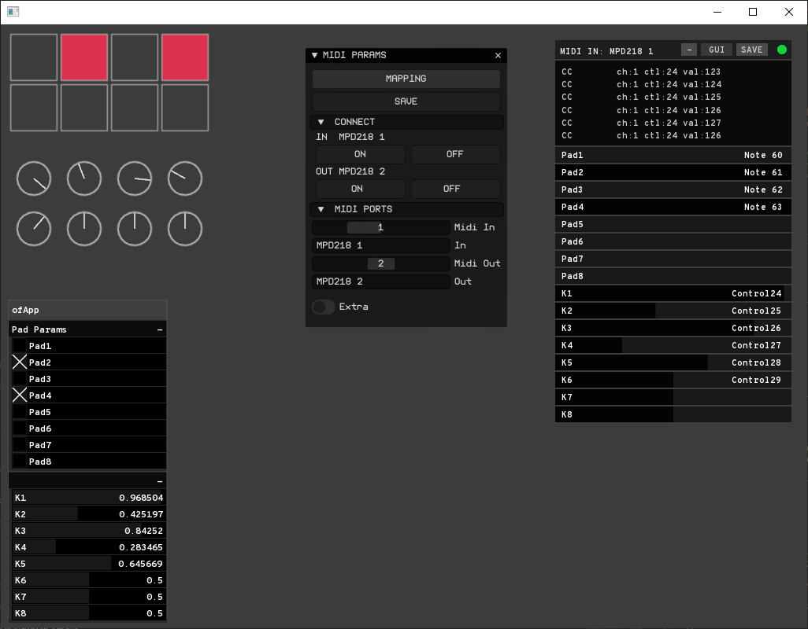

# ofxMidiParams

This is a modified FORK from [ofxMidiParams](https://github.com/NickHardeman/ofxMidiParams)

## New features:
+ ImGui and customized theme.
+ Improved workflow.
+ Midi Output to get note feedback.

## Dependencies
* ofxSurfingImGui
* ofxSurfingHelpers
* ofxMidi
* ofxImGui

Bridge between ofxMidi and ofParameter. Simple interface to quickly perform midi learning for ofParameters. 
Requires ofxMidi (https://github.com/danomatika/ofxMidi)

